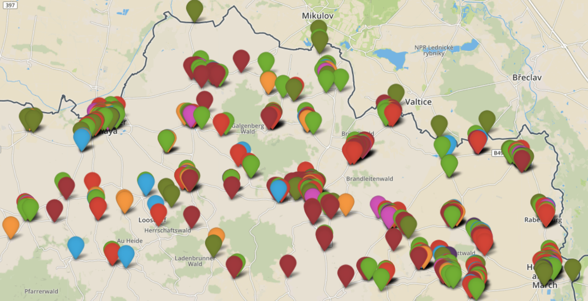

# BETTER-hackathon
In this repository you will find a [docker-compose.yml](./docker-compose.yml) for running Hadoop/Spark cluster locally.
The cluster also includes [Hue](http://gethue.com/) for navigation and copying file to HDFS.
The notebooks are created and run using [Apache Zeppelin](https://zeppelin.apache.org/).

# Requirements
* Docker Engine >= 1.13.0
* docker-compose >= 1.10.0
* Around 10 GB of disk space for Docker images
* Around 8 GB of RAM on the hosting computer and 4 GB on the Docker image


After installation of docker add yourself to docker group (%username% is your username) and relogin:
```
sudo usermod -aG docker %username%
```
This allows to run docker commands without sudo prefix (necessary for running make targets).

# Getting started
Get the hackathon jar file (requires ```wget```):
```
make
```
Start the cluster (this will lead to downloading BDE docker images, will take a while):
```
make up
```
When start-up is done you will be able to access the following interfaces:
* http://localhost:8080/ (Spark Master)
* http://localhost:8088/home (Hue HDFS Filebrowser)
* http://localhost/ (Zeppelin)
To load the data to your cluster simply do:
```
make load-data
```
Go on and open [Zeppelin](http://localhost), choose any available notebook and try to execute it.


To restart Zeppelin without restarting the whole stack:
```
make restart
```
Stop the whole stack:
```
make down
```
# Executing hackathon From Command Line
It is also possible to execute the applications from the command line. Get SANSA-Examples jar and start the cluster if you already have not done it:
```
make
make up
make load-data
```

# Notes
* The instructions from this repo were tested on Ubuntu 18.04 and Macos 10.15.5 with Docker engine 17.03. and Docker engine 19.03.13

